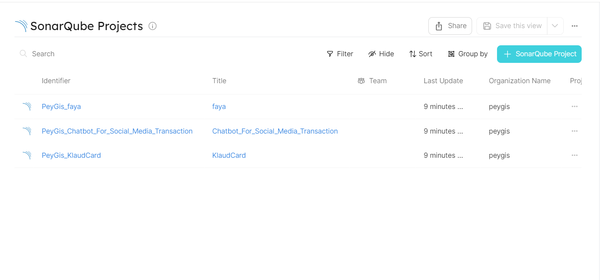

# Ingesting SonarQube Projects

## Getting started

In this example, you will create a blueprint for `sonarqubeProject` that ingests all projects within your SonarQube organization. You will then add some python script (`ingest.py`) to make API calls to SonarQube Web API and fetch data for the `sonarqubeProject` entities.

## Project Blueprint
Create the SonarQube project blueprint in Port [using this json file](./resources/sonarqube_project_blueprint.md)

## Variables
The list of required variables to run this project are:
- `SONARQUBE_ORGANIZATION_ID`
- `WEBHOOK_URL`
- `SONARQUBE_URL`
- `SONARQUBE_TOKEN`
- `PORT_CLIENT_ID`
- `PORT_CLIENT_SECRET`

Follow the documentation on how to [obatin a SonarQube token](https://docs.sonarqube.org/latest/user-guide/user-account/generating-and-using-tokens/).

### Project Entity Created
